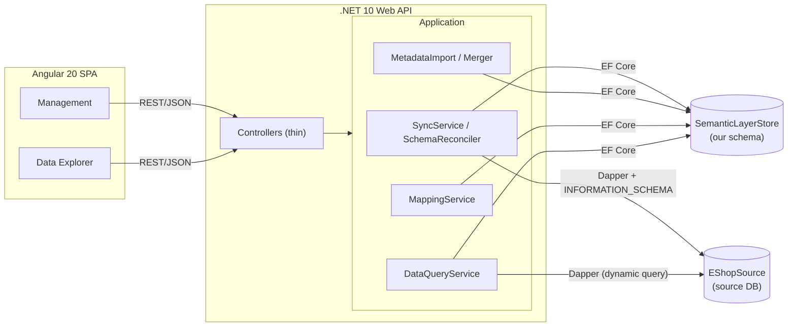
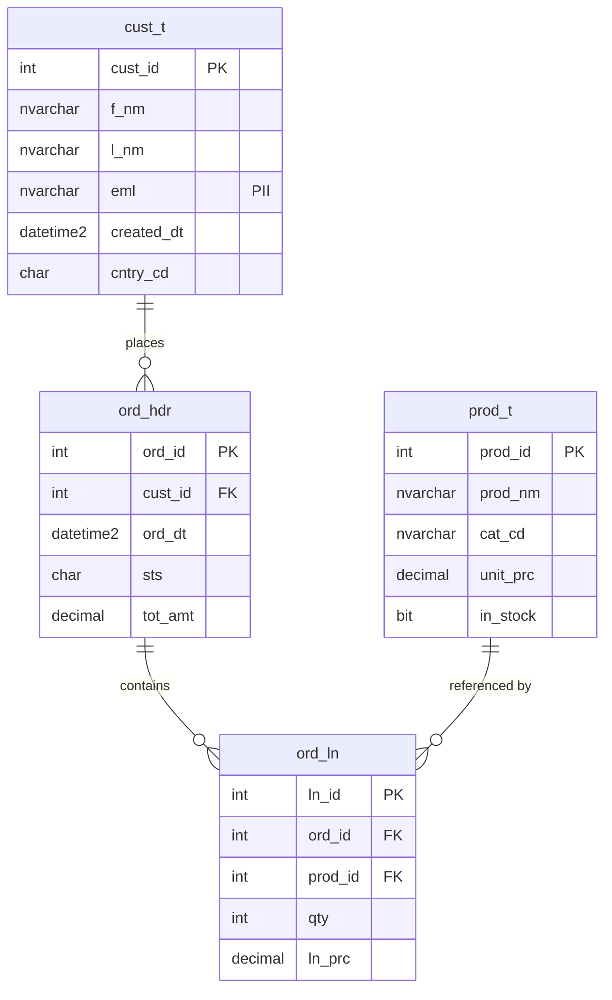
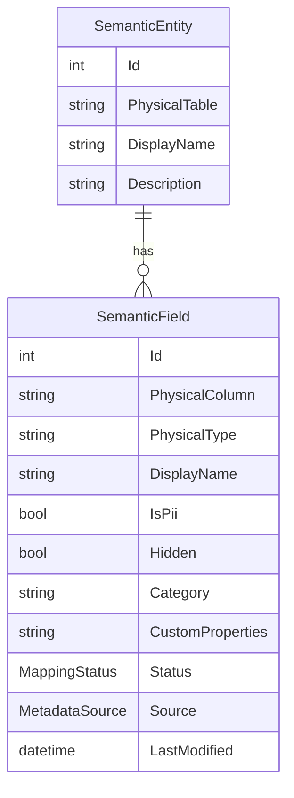

# Design Document — Semantic Layer Manager

## 1. Overview

Business users need to work with data without knowing table names, column names, or SQL.
A **semantic layer** sits between the physical database and the user: it maps technical
objects to business terms, adds descriptions and classifications, hides complexity, and
protects sensitive data.

This system lets a steward **build and manage** such a layer over a relational database, and
lets a consumer **browse data through it**. The mapping is assembled from three sources —
the live database schema, an external metadata file, and manual edits — and kept in sync as
the database evolves.

## 2. Architecture

**Key architectural decision — two databases, two data-access strategies.** The system
touches two databases with opposite characteristics:

| | Semantic store (ours) | Source database |
|---|---|---|
| Schema | Known, code-first | **Unknown at compile time** |
| Access | **EF Core** (+ migrations) | **Dapper / ADO.NET + `INFORMATION_SCHEMA`** |

EF Core is perfect for our own fixed schema, but useless against a database whose tables we
don't know in advance — so the source database is read via introspection and dynamic,
parameterised SQL. The backend is a single project layered by folder
(`Domain` / `Application` / `Infrastructure` / `Controllers`); the reconcile and merge
engines are pure functions with no I/O, which makes them directly unit-testable.

## 3. Data model

There are **two** data models: the **business (source) model** we designed for the demo, and
the **semantic store** that describes and maps over it.

### 3.1 Business (source) data model — e-commerce

A small e-commerce domain: **customers** (`cust_t`) place **orders** (`ord_hdr`); each order
has **line items** (`ord_ln`) that reference **products** (`prod_t`), enforced by foreign keys.
It was chosen deliberately because it provides (a) real **relationships** to expose in business
terms, (b) **terse/technical names** (`f_nm`, `eml`, `sts`, `tot_amt`) that make the semantic
layer's translation valuable, and (c) natural **PII** (`eml`) to demonstrate masking. It is
created and seeded by the scripts in [`/database`](../database). The system treats this schema
as **unknown** and discovers it by introspection — it is not modelled in code.

### 3.2 Semantic store data model

Each `SemanticEntity` maps to one physical table, and each `SemanticField` to one physical
column. The model is **hybrid**: a typed core the engine reasons about (`DisplayName`,
`Description`, `IsPii`, `Hidden`, `Category`) plus a flexible `CustomProperties` JSON bag for
per-column extras that vary by column (currency, date format, value labels, masking). The
rule: *if the engine branches on it, it is a typed column; if it is only descriptive, it goes
in the bag.* Each field also records `Status`, `Source`, and `LastModified` for reconciliation
and merge bookkeeping.

## 4. Sync process

Sync reconciles the physical schema against the stored model. Triggers: automatically when the
management screen loads, on the explicit **Sync now** button, and on metadata upload.

Steps: **introspect** the source schema → **load** the current store → **diff** → **persist** →
return a **report**. Per column the diff yields one of four states:

| State | Meaning | Action |
|---|---|---|
| **New** | in DB, not in store | add as `Unmapped` |
| **Orphaned** | in store, not in DB | flag `Orphaned` — **enrichment is never deleted** |
| **TypeChanged** | type differs | flag for review, update stored type |
| unchanged | identical | leave as-is (a reappearing column is `Restored`) |

**Idempotency.** A no-op resync writes nothing: values (and `LastModified`) change only on a
real difference. This is verified by unit tests and observed live (second sync → 0 changes).

**Persistence detail.** The reconcile mutates EF-tracked entities in place, so field
modifications and new fields on existing entities are saved by change tracking; only brand-new
entities (new tables) are explicitly added.

## 5. Metadata merge & precedence

The three sources have different authority: the **database** owns *structure*; the **file**
provides business *defaults*; **manual edits** are the interactive path. The merge policy is
**last-write-wins with delta detection** — a property is written only when it differs, and any
touched field is stamped with its `Source` and a fresh timestamp. Re-importing the same file is
therefore a no-op. Columns/tables the file names but the store doesn't have are reported as
*unmatched*, never invented.

## 6. Consumer data path

`DataQueryService` builds a dynamic query over the source DB exposing **only** `Mapped`,
non-hidden columns, under their business names. Security is layered:

- **Values** are always passed as SQL **parameters**.
- **Identifiers** (table/column names) cannot be parameterised, so they are **whitelisted**
  against the live introspected schema and bracket-escaped before use — preventing SQL injection.
- Paging uses parameterised `OFFSET/FETCH`, ordered by the primary key.
- **PII** values are **masked** on the way out (short prefix + email domain kept).
- **Business presentation**: each column's `customProperties` (value labels, currency,
  date format) travel to the consumer, which applies them — e.g. `S` → `Shipped`,
  `349` → `₪349.00`, dates as `dd/MM/yyyy`.

**Secure-by-default:** a newly discovered column is `Unmapped` and hidden from consumers until a
human maps it — so an unreviewed column (possibly PII) is never exposed unmasked.

## 7. Key design decisions & assumptions

- **SQL Server 2022** as both source and store engine; connection strings are configurable
  (default `localhost`).
- **EF Core for the store, Dapper for the source** (section 2).
- **Hybrid metadata model** (section 3).
- **Last-write-wins** merge with source/timestamp tracking (section 5).
- **Secure-by-default** visibility (section 6).
- The store schema is **auto-migrated on startup** so no `dotnet-ef` tool is needed to run it.
- Assumes a single `dbo` schema and single-steward usage.

## 8. Limitations

- **Column renames** are seen by introspection as *drop + add*, so enrichment attaches to the
  old name and is orphaned; there is no automatic re-map.
- Schema changes are detected **on sync**, not in real time.
- The consumer view is intentionally **basic**: read-only, no joins/aggregations/query-builder.
- No authentication / multi-user concurrency; a single source connection.

## 9. Future improvements

- Scheduled background sync with **drift notifications**.
- A **re-map** action for renamed columns; richer conflict resolution (per-source precedence
  with a review queue) instead of pure last-write-wins.
- Virtual/computed fields defined in the metadata file.
- Multiple database providers behind `ISchemaIntrospector`; authentication and role-based access.
